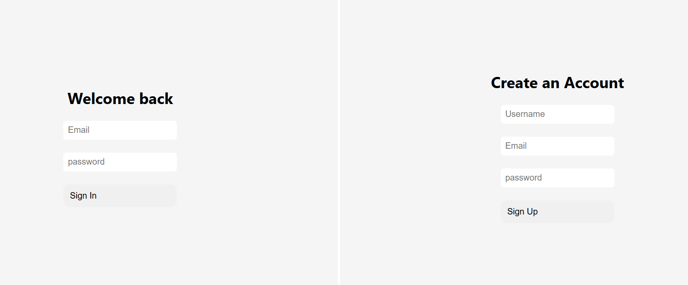
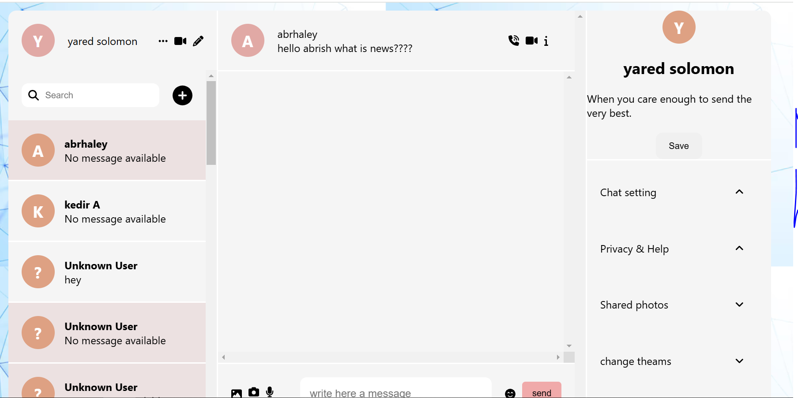

# Chat Application

## What Do I Want to Build?
I want to build a chat application that includes the following features:

- **Messaging**: Real-time text-based communication between users.
- **Searching for Users**: A search functionality to find other users by name or unique identifiers.
- **Adding Users**: Ability to send and accept friend requests to connect with others.
- **Profile Management**: Options to update profile details such as name, picture, and bio.
- **User Listings and Details**: A list of users with detailed profiles for easy connection.

## How Do I Want to Build It?

### Development Stack

- **Frontend**: React.js with Tailwind CSS for a modern and responsive user interface.
- **Backend**: Firebase for backend services, including authentication, database, and hosting.
- **Database**: Firebase Firestore for user data and chat history storage.
- **Real-Time Communication**: Firebase Realtime Database for instant updates and messaging.
- **Authentication**: Firebase Authentication for secure user login and registration.
- **Deployment**: Firebase Hosting for easy and scalable deployment.
- **Version Control**: Git and GitHub for collaboration and version tracking.

### Development Steps

1. **Setup**: Initialize the project with React and integrate Firebase.
2. **Authentication**: Set up Firebase Authentication for user registration and login.
3. **Real-Time Features**: Implement messaging and calling functionality using Firebase Realtime Database.
4. **Database Design**: Structure Firestore to manage users, messages, and friend connections efficiently.
5. **Frontend**: Build the UI for messaging, user search, profile management, and user listing.
6. **Testing**: Perform unit and integration testing for both frontend and backend.
7. **Deployment**: Deploy the application using Firebase Hosting and conduct final testing on live servers.


# Chat Application - login page

This is a preview of the Chat Application:



 
# Chat Application - chat page

This is a preview of the Chat Application:




## Installation and Setup

1. Clone the repository:
   ```bash
   git clone https://github.com/your-username/chat-app.git
   cd chat-app
   ```

2. Install dependencies:
   ```bash
   npm install
   ```

3. Configure Firebase:
   - Create a Firebase project at [Firebase Console](https://console.firebase.google.com/).
   - Enable Authentication, Firestore, and Realtime Database.
   - Add your Firebase configuration to a `.env` file:
     ```env
     REACT_APP_FIREBASE_API_KEY=your_api_key
     REACT_APP_FIREBASE_AUTH_DOMAIN=your_auth_domain
     REACT_APP_FIREBASE_PROJECT_ID=your_project_id
     REACT_APP_FIREBASE_STORAGE_BUCKET=your_storage_bucket
     REACT_APP_FIREBASE_MESSAGING_SENDER_ID=your_sender_id
     REACT_APP_FIREBASE_APP_ID=your_app_id
     ```

4. Start the development server:
   ```bash
   npm start
   ```

## Contributing

1. Fork the repository.
2. Create a feature branch:
   ```bash
   git checkout -b feature-name
   ```
3. Commit your changes:
   ```bash
   git commit -m "Add feature description"
   ```
4. Push to the branch:
   ```bash
   git push origin feature-name
   ```
5. Open a pull request.


### Author
 ### Abrish-seng
## License

This project is licensed under the MIT License. See the LICENSE file for details.
